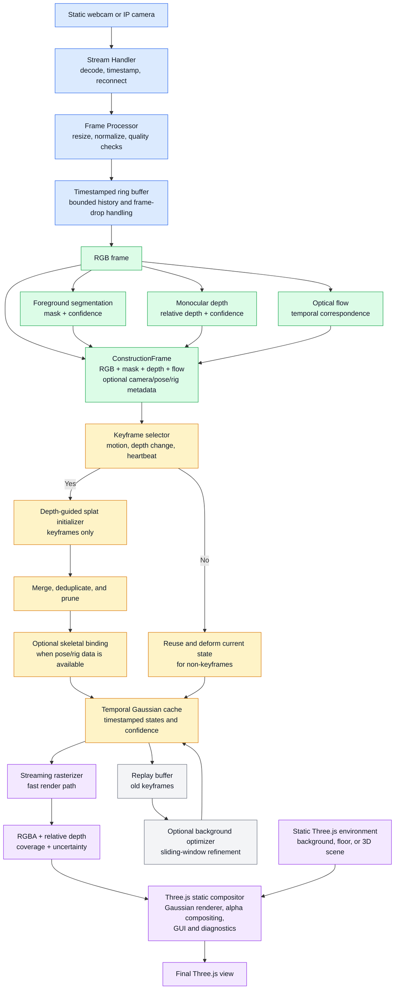

# Single-Camera Visual Reconstruction Workflow

This document describes the reconciled MVP and its extension path. The base system uses one static camera and learned visual signals. Skeletal animation, online optimization, and richer metadata are optional extensions rather than prerequisites for the first working demo.

## Base streaming pipeline



## MVP scope

The first implementation should include:

- One static webcam or IP camera.
- Live input with a bounded ring buffer and timestamp ordering.
- Frame preprocessing and quality checks.
- Foreground segmentation.
- Monocular relative-depth estimation.
- Optical flow for temporal correspondence.
- Keyframe selection with a configurable heartbeat.
- Depth-guided Gaussian initialization for keyframes.
- Merge, deduplication, confidence tracking, and pruning.
- Temporal reuse for non-keyframes.
- RGBA, relative depth, coverage, and uncertainty output.
- Three.js rendering over a static environment or background.

The initial viewer should remain close to the capture camera. Small virtual-camera movements are acceptable; large viewpoint changes and hidden-surface reconstruction are outside the reliable single-camera scope.

## Optional extension layers

The same `ConstructionFrame` can carry additional data when available:

```text
ConstructionFrame {
    rgba_or_rgb
    foreground_mask
    mask_confidence
    relative_depth
    depth_confidence
    optical_flow
    flow_valid_mask
    optional_camera_intrinsics
    optional_camera_extrinsics
    optional_skeletal_pose
    optional_bone_hierarchy
    optional_skinning_weights
}
```

When skeletal data is present, the Splat Constructor can add per-Gaussian binding and pose-aware deformation. This enables an animatable asset without changing the base RGB, mask, depth, and flow pipeline.

The replay buffer and background optimizer are quality extensions. They should refine persistent Gaussian state asynchronously and must not block the fast rendering path.

## Module ownership

The five-person work split maps to the diagram as follows:

- Teammate 1: Stream Handler and Frame Processor.
- Teammate 2: Foreground Segmentation.
- Teammate 3: Depth and Optical Flow.
- Teammate 4: Temporal Cache and Three.js Viewer.
- Project lead: Splat Constructor, shared integration, and evaluation.

## Future multi-camera extension

The `ConstructionFrame` can later be extended to a synchronized set of camera observations:

```text
Camera array
    → frame synchronization and calibration
    → per-camera RGB, segmentation, depth, and flow
    → multi-view correspondence and pose estimation
    → multi-angle Gaussian construction
```

The temporal cache, Gaussian state format, rasterizer outputs, and Three.js compositor should remain reusable for this extension.
