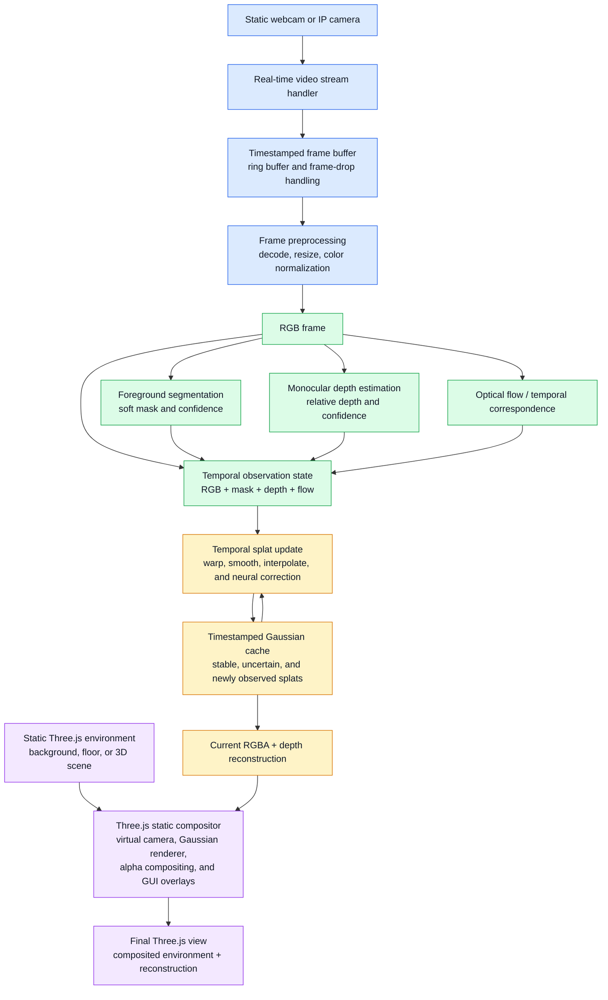

# Single-Camera Visual Reconstruction Workflow



## MVP scope

- One static, initially uncalibrated webcam or IP camera.
- Real-time RGB frame ingestion.
- Foreground segmentation.
- Monocular relative-depth estimation.
- Optical-flow-based temporal correspondence.
- Timestamped Gaussian states for smoothing, interpolation, and dropped-frame recovery.
- RGBA and depth reconstruction output.
- A Three.js viewer that composites the reconstruction over a static 3D environment or background.

The initial viewer should remain close to the capture camera. Small virtual-camera movements can be supported, but large viewpoint changes are outside the reliable scope of the single-camera MVP.

## Future multi-camera extension

The single-camera observation state can later be extended with synchronized views from at least two cameras:

```text
RGB + segmentation + depth + optical flow
        + camera calibration
        + multi-view correspondence
        + pose estimation
        + multi-angle depth and segmentation
```

The Three.js compositor and timestamped Gaussian-cache interfaces should remain reusable when that extension is implemented.
